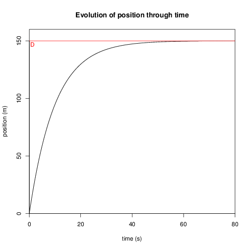

[](https://travis-ci.org/diagrams/diagrams-pandoc)

A [pandoc](http://johnmacfarlane.net/pandoc/) filter to embbed R plots inside markdown documents.

## Usage

Install R:

    sudo apt-get install r-base


Create an input file called `demo.md` with the following text:

``` R
\``` {.R}
Here is a nice plot:
require(stats)
D = 150
T = 10
t = seq(0, 80, 0.01)
x = -D*exp(-(t/T))+D
v = (D/T)*exp(-(t/T))
plot(t, x, type="l", main="Evolution of position through time", xlab="time (s)", ylab="position (m)", xlim=c(0,80), ylim=c(0, D+10),  xaxs = "i", yaxs = "i")
\```
```

Now run:
``` shell
    pandoc -t html demo.md --filter R-pandoc -o demo.html -s
```

The file demo.html should now have a nice plot included:




## Details

`R-pandoc` compiles code blocks containing R plots
and includes the resulting images in the pandoc markup.  It is meant
to be run as a
[pandoc filter](http://johnmacfarlane.net/pandoc/scripting.html) as
shown above.

`R-pandoc` is aware of two code block classes.  A block with
the `R` class will be replaced by the resulting plot---the code
will not appear in the output.  

## Installing


``` shell
    git clone https://github.com/cdupont/R-pandoc.git
    cd R-pandoc
    cabal install
```

